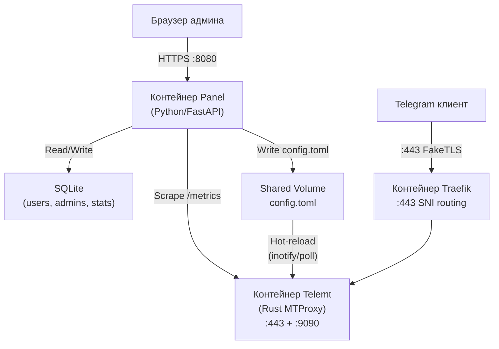

# Панель управления MTpannel для Telemt

## Текущая архитектура

Проект telemt -- MTProxy на Rust с поддержкой Fake TLS. Текущее состояние:

- Пользователи (секреты) задаются статически в `config.toml` в секции `[access.users]`
- Лимиты (`user_max_tcp_conns`, `user_data_quota`, `user_expirations`, `user_max_unique_ips`) тоже в TOML
- Конфиг поддерживает **hot-reload** -- изменения `config.toml` подхватываются без перезапуска
- Статистика хранится только в памяти (теряется при рестарте), экспортируется через Prometheus `/metrics`
- Установочный скрипт `[install.sh](install.sh)` поддерживает интерактивное меню и автоматический режим
- Нет веб-интерфейса; нет постоянного хранилища

## Целевая архитектура

Добавить **панель управления** mtкак отдельный Docker-контейнер (сайдкар), который:

1. Управляет пользователями и их секретами в SQLite
2. Перегенерирует `config.toml` для telemt при каждом изменении пользователя (используя hot-reload)
3. Предоставляет REST API и Web UI
4. Сохраняет статистику трафика, периодически опрашивая Prometheus-эндпоинт telemt

Установочный скрипт `install.sh` поддерживает два режима:

- **Только прокси** -- как сейчас (telemt + traefik)
- **Прокси + панель** -- telemt + traefik + panel (новый контейнер)




### Разделение контейнеров


| Контейнер          | Образ                     | Порты              | Назначение                         |
| ------------------ | ------------------------- | ------------------ | ---------------------------------- |
| `mtpanel-traefik` | `traefik:v3.6`            | `:443` (хост)      | SNI-маршрутизация, TLS passthrough |
| `mtpanel-telemt`  | `telemt:local` / prebuilt | внутренний `:1234` | MTProxy с Fake TLS                 |
| `mtpanel-panel`   | `panel:local`             | `:8080` (хост)     | REST API + Web UI                  |


Контейнеры panel и telemt связаны через:

- **Shared volume** для `config.toml` (panel пишет, telemt читает)
- **Docker network** `mtpanel` (panel скрейпит метрики telemt по `http://mtpanel-telemt:9090/metrics`)

## Стек технологий

**Бэкенд панели:**

- Python 3.11+ с FastAPI
- SQLAlchemy 2.0 + Alembic (SQLite)
- Pydantic v2 для валидации
- PyJWT + passlib/bcrypt для аутентификации
- `tomli_w` для генерации TOML-конфига telemt
- `httpx` для асинхронного скрейпинга Prometheus
- APScheduler для периодического сбора статистики

**Фронтенд (дашборд):**

- React 18 + TypeScript + Vite
- Chakra UI (по аналогии с Marzban)
- React Query для запросов к API
- React Router v6
- qrcode.react для генерации QR-кодов
- ApexCharts для графиков трафика/мониторинга
- Zustand для управления состоянием

## Схема базы данных (SQLite)

```
admins:
  id, username, hashed_password, is_sudo, created_at

users:
  id, username, secret (32 hex), status (active/disabled/limited/expired),
  data_limit (bytes, nullable), data_used (bytes, default 0),
  max_connections (nullable), max_unique_ips (nullable),
  expire_at (datetime, nullable),
  note, created_at, created_by_admin_id

traffic_logs:
  id, user_id, octets_from, octets_to, recorded_at

system_stats:
  id, uptime, total_connections, bad_connections, recorded_at
```

## Ключевые возможности и реализация

### 1. CRUD пользователей с управлением секретами

- `POST /api/users` -- создание пользователя, автогенерация 32-hex секрета через `secrets.token_hex(16)`
- `GET /api/users` -- список с пагинацией, фильтрацией, сортировкой
- `PUT /api/users/{username}` -- обновление лимитов, статуса, заметки
- `DELETE /api/users/{username}` -- удаление пользователя
- `POST /api/users/{username}/regenerate-secret` -- новый секрет, новая ссылка

При каждой мутации пользователя панель перегенерирует `config.toml`:

- Читает всех активных пользователей из SQLite
- Записывает секции `[access.users]`, `[access.user_max_tcp_conns]`, `[access.user_data_quota]`, `[access.user_expirations]`, `[access.user_max_unique_ips]`
- Сохраняет остальные секции конфига (general, server, censorship и т.д.) из шаблона
- Telemt подхватывает изменения через hot-reload (inotify/poll, уже реализовано)

### 2. Генерация ссылок и QR-кодов

- Для каждого пользователя генерируется `tg://proxy?server={host}&port={port}&secret=ee{secret}{domain_hex}` (формат FakeTLS)
- Домен и хост/порт берутся из конфига панели (зеркалят `censorship.tls_domain` и `general.links` telemt)
- QR-код генерируется на фронтенде через `qrcode.react`
- Также доступна deep-ссылка: `https://t.me/proxy?server=...&port=...&secret=...`

### 3. Мониторинг трафика и сохранение статистики

- Фоновая задача (каждые 30 сек.) скрейпит `http://mtpanel-telemt:9090/metrics`
- Парсит per-user метрики `telemt_user_octets_from_client` / `telemt_user_octets_to_client`
- Вычисляет дельты от прошлого скрейпа, сохраняет в `traffic_logs`
- Обновляет `users.data_used` (кумулятивно)
- Когда `data_used >= data_limit`, устанавливает статус `limited` и перегенерирует конфиг (убирает пользователя)
- Системные метрики (uptime, подключения) сохраняются в `system_stats`

### 4. Лимиты сессий/подключений

- `max_connections` на пользователя маппится в `[access.user_max_tcp_conns]` в конфиге telemt
- `max_unique_ips` маппится в `[access.user_max_unique_ips]`
- Применение лимитов происходит в Rust-коде telemt (уже реализовано в `[src/proxy/client.rs](src/proxy/client.rs)` `check_user_limits_static`)

### 5. Срок действия

- `expire_at` на пользователя маппится в `[access.user_expirations]` в конфиге telemt
- Фоновая задача также проверяет просроченных пользователей и обновляет их статус
- Применение в Rust-коде telemt (уже реализовано)

### 6. Аутентификация администраторов

- JWT-аутентификация (OAuth2 password flow)
- `POST /api/admin/token` -- логин, возвращает JWT
- Флаг `is_sudo` для суперадмина (создание/удаление других админов)
- Первый sudo-админ создается при установке или через CLI: `python -m panel create-admin --sudo`

### 7. Дашборд мониторинга сервера

- Данные в реальном времени из скрейпленных Prometheus-метрик
- Графики: трафик по времени (по пользователям и общий), активные подключения, uptime
- Системная информация: CPU/память через `psutil`

### 8. Поддержка нескольких администраторов (WIP)

- Каждый админ видит только своих пользователей (кроме sudo)
- Sudo-админ видит всех пользователей и может управлять другими админами

## Структура проекта

```
panel/                          # Новый каталог в корне проекта
  backend/
    app/
      __init__.py
      main.py                   # Точка входа FastAPI
      config.py                 # Настройки панели (из .env)
      database.py               # SQLAlchemy engine/session
      models/                   # SQLAlchemy ORM-модели
        admin.py
        user.py
        stats.py
      schemas/                  # Pydantic-схемы запросов/ответов
        admin.py
        user.py
        system.py
      routers/                  # API-эндпоинты
        admin.py
        user.py
        system.py
      services/
        config_writer.py        # Генератор telemt config.toml
        metrics_scraper.py      # Скрейпер Prometheus-эндпоинта
        user_service.py         # Бизнес-логика
      utils/
        auth.py                 # JWT-утилиты
        links.py                # Генерация прокси-ссылок
    alembic/                    # Миграции БД
    alembic.ini
    requirements.txt
    tests/                      # pytest-тесты
  frontend/
    src/
      components/               # Переиспользуемые UI-компоненты
      pages/                    # Dashboard, Users, Login
      api/                      # React Query хуки
      stores/                   # Zustand stores
      utils/                    # Утилиты ссылок/QR
    package.json
    vite.config.ts
  Dockerfile                    # Multi-stage: сборка фронтенда + uvicorn
```

## Docker Compose: два режима

### Режим "только прокси" (текущий, без изменений)

Файл: `install/docker-compose.yml` -- traefik + telemt (как сейчас).

### Режим "прокси + панель"

Файл: `install/docker-compose.panel.yml` -- расширяет базовый, добавляет panel:

```yaml
services:
  traefik:
    # ... как в базовом ...

  telemt:
    # ... как в базовом, но config.toml на shared volume ...
    volumes:
      - telemt-config:/app/config:rw   # shared с panel

  panel:
    build:
      context: ${REPO_ROOT}/panel
      dockerfile: ${REPO_ROOT}/panel/Dockerfile
    image: panel:local
    container_name: mtpanel-panel
    restart: unless-stopped
    ports:
      - "${PANEL_PORT:-8080}:8080"
    volumes:
      - telemt-config:/app/telemt-config    # shared с telemt
      - panel-data:/app/data                 # SQLite + состояние
    environment:
      - TELEMT_CONFIG_PATH=/app/telemt-config/config.toml
      - TELEMT_METRICS_URL=http://mtpanel-telemt:9090/metrics
      - DATABASE_URL=sqlite:////app/data/panel.db
      - SECRET_KEY=${PANEL_SECRET_KEY}
      - PROXY_HOST=${PROXY_HOST}
      - PROXY_PORT=${LISTEN_PORT:-443}
      - TLS_DOMAIN=${FAKE_DOMAIN}
    networks:
      - mtpanel
    depends_on:
      - telemt

volumes:
  telemt-config:
  panel-data:

networks:
  mtpanel:
    driver: bridge
```

## Стратегия генерации конфига

Панель хранит **шаблон** всех не-пользовательских секций конфига (general, server, censorship и т.д.) -- либо парсит из начального конфига, либо хранит отдельно. При изменении пользователей:

1. Загрузить шаблон (неизменяемые настройки прокси)
2. Запросить всех активных пользователей из SQLite
3. Сформировать секции `[access.users]`, `[access.user_max_tcp_conns]` и т.д.
4. Объединить и записать в `config.toml`
5. Telemt обнаружит изменение и выполнит hot-reload

Панель -- **единственный источник истины** для данных пользователей, telemt -- источник истины для настроек прокси.

## Обновление install.sh

Текущий скрипт `[install.sh](install.sh)` поддерживает интерактивное меню (установка, удаление, обновление, смена домена, статус). Необходимо добавить:

- Вопрос в процессе установки: **"Установить панель управления? (y/N)"**
- При "y": генерация `docker-compose.panel.yml`, генерация `PANEL_SECRET_KEY`, запрос пароля sudo-админа, вывод URL панели
- При "N": установка как сейчас (только прокси)
- Переменная окружения `INSTALL_PANEL=yes/no` для автоматического режима
- При удалении: корректная очистка данных панели (volume panel-data)

## Git-workflow

Ветка `mtpanel` слита в `main`; дальнейшая разработка ведётся в `main`. Для крупных фич можно создавать отдельную ветку от `main`, затем merge в `main`.

### Порядок действий (актуально после слияния)

1. Работа по умолчанию в `main`
2. При необходимости — ветка от `main`, коммиты по фазам, затем merge в `main`
3. Перед merge в `main` — фаза 11 (аудит безопасности) и исправление найденных проблем

## Порядок реализации

Фазы выполняются последовательно. Каждая фаза имеет критерии верификации -- фаза не считается завершенной до прохождения проверки.

### Фаза 0: Уточнение архитектуры (до начала кодирования)

- Финализация API-контрактов (OpenAPI-схема)
- Финализация схемы БД
- Формат шаблона config.toml и алгоритм мерджа
- Протокол взаимодействия panel <-> telemt (shared volume + metrics scraping)
- Результат: `[docs/architecture.md](docs/architecture.md)`
- **Верификация:** ревью документа перед продолжением

### Фазы 1-4: Бэкенд

- Фаза 1: Каркас FastAPI + модели + auth
- Фаза 2: CRUD пользователей + config writer
- Фаза 3: Генерация ссылок
- Фаза 4: Сборщик метрик
- **Верификация каждой фазы:** pytest, проверка запуска сервера, корректность ответов API

### Фазы 5-7: Фронтенд

- Фаза 5: Каркас React + Chakra UI + роутинг
- Фаза 6: Страница управления пользователями
- Фаза 7: Дашборд мониторинга
- **Верификация каждой фазы:** npm run build, визуальная проверка через браузер

### Фазы 8-9: Инфраструктура

- Фаза 8: Dockerfile панели + docker-compose
- Фаза 9: Обновление install.sh
- **Верификация:** `docker-compose up --build -d`, оба режима install.sh работают

### Фаза 10: Интеграционное тестирование (после всех фаз)

- Полный end-to-end сценарий
- **Верификация:** весь путь от install.sh до работающей прокси-ссылки через панель

### Фаза 11: Аудит безопасности (после интеграционного тестирования)

Перед слиянием в main -- комплексная проверка безопасности всего нового кода:

- **Бэкенд (Python):**
  - SQL-инъекции: проверка использования параметризованных запросов SQLAlchemy
  - Аутентификация: проверка JWT (срок действия, подпись, отзыв), хеширование паролей (bcrypt)
  - Авторизация: проверка прав доступа на каждом эндпоинте (sudo vs обычный админ)
  - Секреты: нет hardcoded ключей, SECRET_KEY из переменных окружения, .env в .gitignore
  - Зависимости: `pip-audit` для проверки CVE в Python-пакетах
  - CORS: корректная настройка origins
  - Rate limiting: защита `/api/admin/token` от brute-force
- **Фронтенд (React/TypeScript):**
  - XSS: проверка экранирования пользовательского ввода
  - CSRF: проверка использования JWT (не cookie-based auth)
  - Зависимости: `npm audit` для проверки CVE в npm-пакетах
  - Утечки: нет секретов в клиентском коде, API-ключи не в бандле
- **Инфраструктура (Docker):**
  - Контейнеры: non-root user, read-only filesystem где возможно, минимальные capabilities
  - Volumes: права доступа к shared volume (config.toml не читается извне)
  - Network: panel не экспонирует метрики telemt наружу
  - install.sh: безопасная генерация PANEL_SECRET_KEY (openssl rand)
- **Верификация:** отчёт без критических (Critical) и высоких (High) уязвимостей; все средние (Medium) задокументированы

### Слияние в main (выполнено)

- Ветка `mtpanel` слита в `main`; все коммиты панели и установщика в `main`
- Дальнейшие изменения — в `main` или в короткоживущих ветках с merge в `main`

```mermaid
gantt
    title Порядок выполнения фаз
    dateFormat X
    axisFormat %s

    section Git
    Создание_ветки_mtpanel :gitbranch, 0, 1

    section Архитектура
    Фаза0_Архитектура      :phase0, after gitbranch, 1

    section Бэкенд
    Фаза1_Каркас           :phase1, after phase0, 1
    Фаза2_CRUD             :phase2, after phase1, 1
    Фаза3_Ссылки           :phase3, after phase2, 1
    Фаза4_Метрики          :phase4, after phase3, 1

    section Фронтенд
    Фаза5_Каркас_UI        :phase5, after phase4, 1
    Фаза6_Пользователи     :phase6, after phase5, 1
    Фаза7_Дашборд          :phase7, after phase6, 1

    section Инфраструктура
    Фаза8_Docker           :phase8, after phase7, 1
    Фаза9_InstallSh        :phase9, after phase8, 1

    section Финализация
    Фаза10_E2E             :phase10, after phase9, 1
    Фаза11_Аудит           :phase11, after phase10, 1
    Слияние_в_main         :gitmerge, after phase11, 1
```




### Протокол верификации

Перед отметкой фазы как "завершена":

1. **Запустить автоматические тесты** (pytest / npm run build / docker compose)
2. **Проверить критерии приемки** фазы (описаны в каждом todo)
3. **Запустить линтеры** (ruff/mypy для Python, eslint для TS)
4. **Показать результаты** пользователю -- "Готово к ревью"
5. Только после подтверждения -- отметить как выполнено
6. **Сделать коммит** в ветку `mtpanel` с описанием завершенной фазы

